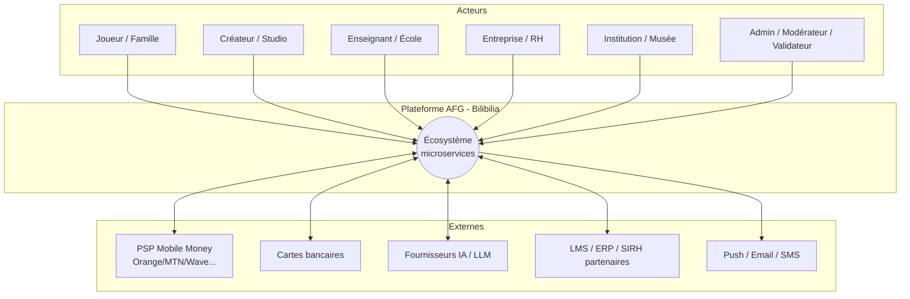
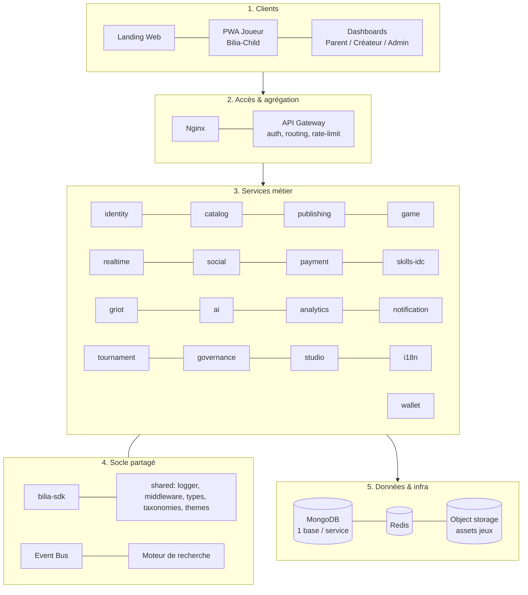
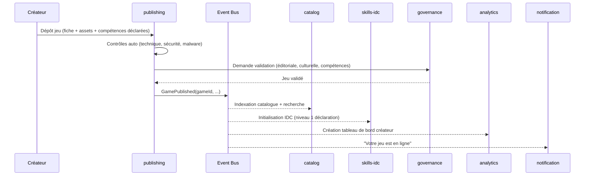
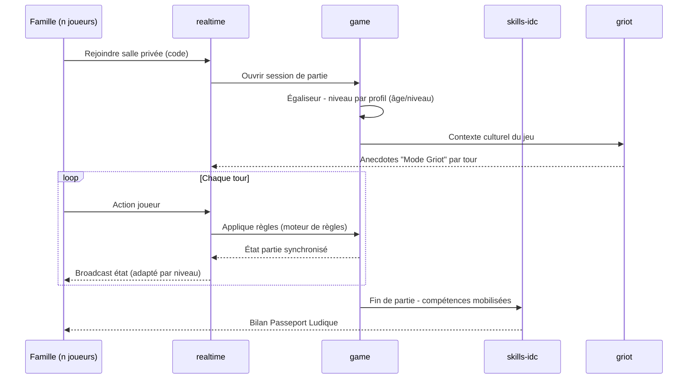
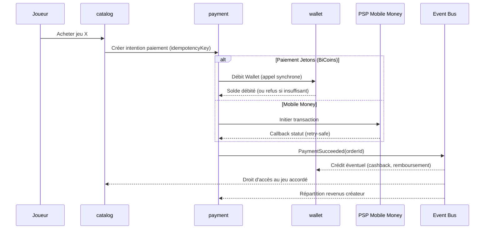
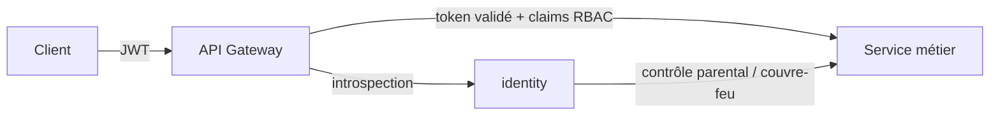
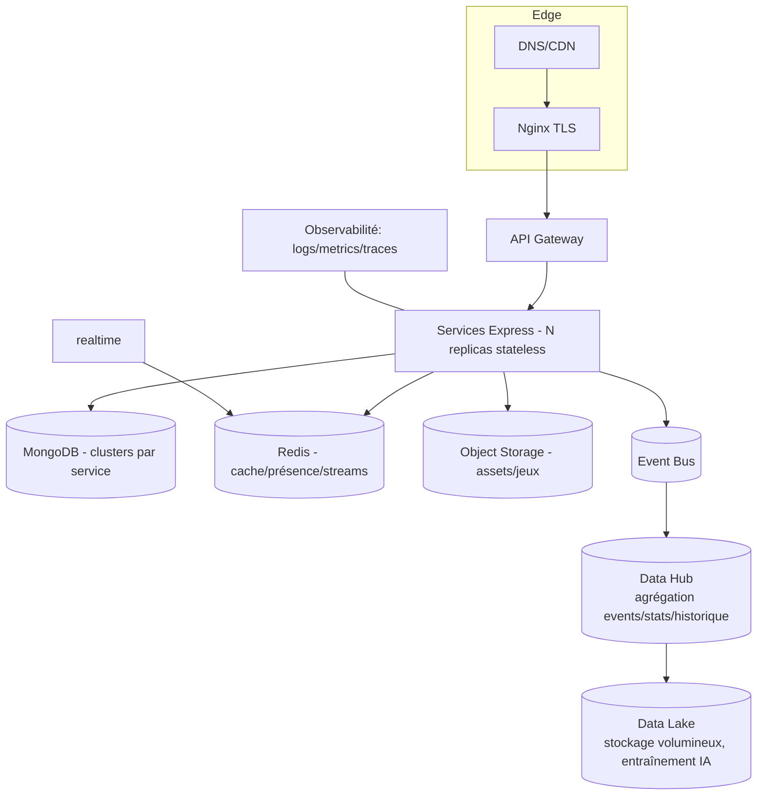

# AFG-DT-001 : Architecture Globale

**African Games Framework : Plateforme Bilibilia**
**Version :** b3 · 20.07.2026

Ce document décrit l'architecture cible : vue système, vue conteneurs, flux d'événements, données et infrastructure. Il s'appuie sur le cadrage AFG-DT-000.

---

## 1. Vue système (contexte)

---

## 2. Vue en couches

La plateforme s'organise en cinq strates. Les 13 couches fonctionnelles du CDCF se répartissent dedans (voir mapping détaillé dans AFG-DT-002).

---

## 3. Vue conteneurs (services & responsabilités)

Découpage en **bounded contexts**. Chaque service = un dépôt de package du monorepo, une base MongoDB, un port.

| # | Service | Port | Domaine | Phase |
| --- | --- | --- | --- | --- |
| 0 | `gateway` | 5000 | Routage, auth edge, rate-limit, agrégation | MVP |
| 1 | `identity-service` | 5001 | Comptes, auth, profils, familles, contrôle parental, couvre-feu, RBAC | MVP |
| 2 | `catalog-service` | 5002 | Marketplace, fiches jeux, taxonomie, recherche, collections | MVP |
| 3 | `publishing-service` | 5003 | Cycle de vie du jeu, dépôt, validation, versioning | MVP |
| 4 | `game-service` | 5004 | Parties, salles, sauvegardes, moteur de règles, égaliseur, succès, classements | MVP |
| 5 | `realtime-service` | 5005 | Socket.io : sync parties, présence, chat live, push temps réel | MVP |
| 6 | `payment-service` | 5006 | Mobile Money, cartes, transactions, abonnements, revenus créateurs | MVP |
| 7 | `skills-idc-service` | 5007 | Référentiel compétences, IDC, moteur de recommandation | MVP |
| 8 | `analytics-service` | 5008 | Analytics multi-acteurs, Passeport Ludique | MVP |
| 9 | `notification-service` | 5009 | Notifications multi-canal (in-app, push, email, SMS) | MVP |
| 10 | `social-service` | 5010 | Amis, invitations, communautés, clubs, chat persistant | P2 |
| 11 | `griot-service` | 5011 | Contenus culturels, fiches, narration (Mode Griot) | P2 |
| 12 | `ai-service` | 5012 | Orchestrateur IA (joueur, famille, créateur, griot, traduction, modération, compétences) | P2 |
| 13 | `tournament-service` | 5013 | Tournois, saisons, événements | P2 |
| 14 | `governance-service` | 5014 | Labels, certification, PI, signalements, réputation, modération humaine | P2 |
| 15 | `i18n-service` | 5015 | Localisation, traduction communautaire puis IA | P2 |
| 16 | `studio-service` | 5016 | Game Studio no-code/low-code, composants, templates, sandbox | P3 |
| 17 | `wallet-service` | 5017 | Solde, Jetons (BiCoins), grand livre monnaie interne : crédité/débité uniquement via appel synchrone de `payment`/`game`/`tournament` | MVP |

> **Filiation de noms avec BiLiA-V4 (prototype abandonné, cf. AFG-DT-004 §1) :** `auth` → `identity`, `core` → éclaté en `catalog`/`skills-idc`, `game` → `game`, `socket` → `realtime`. Le nommage s'en inspire ; le code, lui, est reconstruit from scratch. Le passage à 10 services au MVP se fait **lot par lot** (cf. AFG-DT-003), pas par big-bang.
>
> **Numérotation `wallet-service` (17, MVP) :** extrait de `payment-service` le 17.07.2026 suite à l'alignement sur AFG-002 (ch.22/32/33 : le paiement ne doit jamais manipuler un solde directement). Numéroté hors séquence pour ne pas décaler les ports déjà réservés des services P2/P3 ; port et numéro seront revus lors du prochain renumbering global si besoin. Cf. AFG-DT-002 §1/§2.1 et AFG-DT-004 §6.

---

## 4. Flux d'événements clés

### 4.1 Publication d'un jeu (event-driven)

### 4.2 Partie multijoueur intergénérationnelle (temps réel + égaliseur)

### 4.3 Achat via Jetons / Mobile Money (idempotent)

> **Règle architecturale (AFG-002 ch.22/32/33) :** `payment` ne modifie jamais un solde directement. Tout débit/crédit du Wallet passe par un appel synchrone à `wallet-service`, qui reste seul propriétaire de l'agrégat `Wallet`.

---

## 5. Modèle de données (vue macro)

Chaque service est propriétaire de ses agrégats. Références inter-services par identifiants, jamais par jointure de base.

| Agrégat racine | Service propriétaire | Références sortantes |
| --- | --- | --- |
| `User`, `Family`, `Profile`, `ParentalControl`, `CurfewPolicy` | identity | : |
| `Game`, `GameListing`, `Category`, `Collection` | catalog | `creatorId`, `taxonomy`, `idcId` |
| `Submission`, `GameVersion`, `ValidationReport` | publishing | `gameId`, `creatorId` |
| `GameSession`, `Room`, `Save`, `Achievement`, `Leaderboard`, `RuleSet`, `LevelAssignment` | game | `gameId`, `profileId` |
| `Order`, `Subscription`, `Payout` | payment | `userId`, `gameId`, `creatorId` |
| `Wallet`, `TokenLedger(BiCoins)` | wallet | `profileId`, `familyId` |
| `SkillTaxonomy`, `IDC`, `Recommendation` | skills-idc | `gameId` |
| `PlaythroughStat`, `LudicPassport`, `Dashboard` | analytics | `profileId`, `gameId` |
| `Notification`, `Channel`, `Template` | notification | `userId` |
| `Friendship`, `Community`, `Club`, `ChatMessage` | social | `profileId` |
| `CulturalCard`, `Proverb`, `Story` | griot | `gameId`, `country`, `culture` |
| `Tournament`, `Season`, `Event`, `Match`, `Standing` | tournament | `gameId`, `profileId` |
| `Label`, `Certification`, `Report`, `Reputation`, `IPClaim` | governance | `gameId`, `creatorId` |
| `Locale`, `Translation`, `TranslationJob` | i18n | `gameId` |
| `Project`, `Component`, `Template`, `Sandbox` | studio | `creatorId` |

---

## 6. Sécurité & identité (transversal)

- **AuthN** : identity émet des tokens (access court + refresh). Le gateway valide en périphérie.
- **AuthZ** : RBAC par rôles (joueur, parent, créateur, studio, enseignant, entreprise, institution, traducteur, validateur, modérateur, admin) + permissions fines.
- **Contrôle parental / couvre-feu** : politiques appliquées au runtime (blocage session hors plage, plafonds d'achat, validation d'invitations).
- **Secrets** : coffre (vault) ; aucune clé en clair dans le code.

---

## 7. Infrastructure & déploiement

- **Environnements :** dev (Docker Compose), staging, prod.
- **Scalabilité :** services stateless → horizontal ; `realtime` scalé via adapter Redis Socket.io ; MongoDB en réplicas + sharding si besoin.
- **CI/CD :** lint → test (jest/supertest) → build → scan sécurité → déploiement ; `install-all` / `build-all` orchestrés par les workspaces racine.
- **Object storage :** assets de jeux, captures, sons, packs culturels (CDN devant).
- **Data Hub** (AFG-003 ch.31) : point d'agrégation des événements du bus, des statistiques et de l'historique multi-services : alimente `analytics-service` et les tableaux de bord. Évolution P2+, non nécessaire au MVP (les services consomment directement le bus).
- **Data Lake** (AFG-003 ch.32) : stockage volumineux pour données brutes et jeux d'entraînement IA (recommandation, modération, génération). Alimenté par le Data Hub ; consommé par `ai-service`. Évolution P2+, posée ici comme cible documentée : non implémentée au MVP.

---

## 8. Décisions d'architecture (ADR condensés)

| ID | Décision | Justification |
| --- | --- | --- |
| ADR-01 | Microservices par bounded context | Écosystème ouvert, équipes/roadmaps indépendantes, scalabilité ciblée. |
| ADR-02 | Une base MongoDB par service | Autonomie, découplage, pas de couplage par schéma partagé. |
| ADR-03 | Event bus pour effets de bord | Publication/achat/analytics découplés, résilience, extensibilité. |
| ADR-04 | Temps réel isolé (Socket.io) | Séparer le stateful temps réel du transactionnel ; scaler indépendamment. |
| ADR-05 | SDK + services transverses | Créateurs ne redéveloppent pas l'infra (comptes, save, paiement). |
| ADR-06 | IA en service orchestrateur isolé | Garde-fous, contrôle humain, abstraction fournisseur. |
| ADR-07 | PWA offline-first | Réalités réseau africaines ; installable ; multi-appareils. |
| ADR-08 | Wallet & Jetons internes | Découpler l'économie plateforme des PSP ; micro-transactions fluides. |
| ADR-09 | `wallet-service` séparé de `payment-service` | AFG-002 ch.22/32/33 : le paiement ne doit jamais manipuler un solde directement : règle stricte, pas une simple convention d'organisation. Cf. §4.3, §5. |
| ADR-10 | Cible de décomposition fine (~25 services, AFG-003) documentée, consolidation MVP explicite | Éviter le sur-découpage prématuré tout en gardant une trajectoire claire ; chaque service consolidé du MVP indique où vit chaque service cible et son signal d'extraction. Cf. AFG-DT-002 §3bis. |
| ADR-11 | Éditeur natif C++ (`apps/studio-editor-native`, GDExtension sur Godot Engine) en complément du Studio web, plutôt qu'un remplacement ou un moteur C++ from scratch | Le Studio web (React, no-code/low-code) reste l'entrée accessible sans installation pour les créateurs Niveau 1-2 (AFG-DT-000 §3 principe 10, offline-first). Les créateurs Niveau 3-4 (développeurs, studios pro, AFG-005 ch.1) veulent un outil natif performant en C++ ; Godot (MIT, C++) fournit déjà les six moteurs d'AFG-005 (scènes/règles/événements/variables/UI/animation-audio-vidéo), évitant des années de développement moteur. GDExtension évite tout fork du moteur Godot. Les deux clients consomment la même API `studio-service`/`contracts` : un seul pipeline de publication/certification. Décision utilisateur du 20.07.2026, cf. AFG-DT-004 §7. |

---

*Suite : AFG-DT-002 (catalogue des modules) détaille le mapping couches CDCF → services et la matrice de dépendances.*
