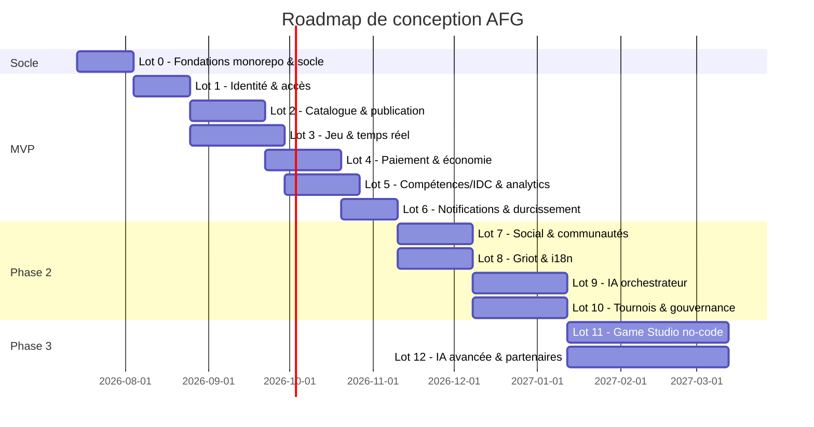
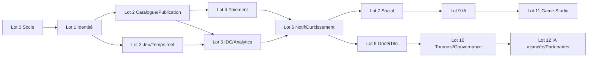

# AFG-DT-003 — Roadmap de Conception

**African Games Framework — Plateforme Bilibilia**
**Version :** b1 · 14.07.2026

Roadmap **de conception et de construction technique** (distincte de la roadmap fonctionnelle du CDCF §13, qu'elle réalise). Le monorepo démarre vide (BiLiA-V4 non conservé en dépôt, cf. AFG-DT-004 §1) ; elle procède par lots livrables construits directement vers la cible.

---

## 1. Principes de séquencement

1. **Le socle avant les features.** `shared` (logger, middleware, types) + `gateway` + `identity` + event bus doivent exister avant tout service métier.
2. **Un flux de valeur bout-en-bout d'abord.** MVP = « découvrir → acheter → jouer → voir ses compétences » fonctionnel, même minimal, plutôt que chaque service complet isolément.
3. **Construction directe vers la cible, lot par lot.** BiLiA-V4 (`auth`, `core`, `game`, `socket`) n'est pas conservé en dépôt (cf. AFG-DT-004 §1) : pas d'extraction de code, mais les conventions qu'il avait validées (pile, découpage, patterns) restent le socle de référence. Chaque service est écrit from scratch à sa forme cible, sans big-bang — un lot à la fois.
4. **Chaque lot est testable et déployable.** Rien n'entre en `main` sans tests (jest/supertest) et sans passer la CI.
5. **Contrats figés tôt.** Types partagés et schémas d'événements (`contracts`) stabilisés avant de multiplier les producteurs/consommateurs.

---

## 2. Vue d'ensemble (jalons)

*(Durées indicatives, à recaler selon l'équipe.)*

---

## 3. Détail des lots

### Lot 0 — Fondations (socle)
**But :** rendre le monorepo prêt à accueillir tous les services.
- `package.json` racine avec **workspaces** ; scripts `install-all` / `build-all` fonctionnels.
- `shared` finalisé : logger Winston + `httpLogger`, middleware `auth`, types, erreurs, `THEMES_REGISTRY`, `timeGuard`.
- Gabarit de service (`app.ts` / `index.ts` séparés, jest.config, Dockerfile).
- `gateway` (Nginx + couche applicative) : routage, TLS, rate-limit.
- Event bus (Redis Streams) + package `contracts` (types d'événements v1).
- CI/CD : lint, test, build, scan ; environnements dev/staging.
- READMEs + ROADMAP par module (gabarit).
**Sortie :** squelette buildable, testable, déployable en staging.

### Lot 1 — Identité & accès (MVP)
- `identity-service` : comptes, auth (access/refresh), profils, **familles (jusqu'à 7 profils)**, **contrôle parental + couvre-feu**, RBAC.
- Intégration gateway ↔ identity (validation token, claims).
- App `dashboard-parent` (v0) : création famille, profils, réglages parentaux.
**Dépend de :** Lot 0.

### Lot 2 — Catalogue & publication (MVP)
- `catalog-service` : fiches jeux, catégories, **taxonomie des jeux**, recherche multicritère, collections, nouveautés/populaires/recommandés (règles simples).
- `publishing-service` : compte créateur, **cycle de vie du jeu (10 étapes)**, dépôt/téléversement, contrôles auto, validation (v0), versioning.
- Événement `GamePublished` → indexation catalogue.
**Dépend de :** Lot 1.

### Lot 3 — Jeu & temps réel (MVP)
- `game-service` : parties, **salles privées (code)**, sauvegardes, **moteur de règles métier (v0 : tours, score, manches, conditions de victoire)**, **égaliseur de niveau (par profil)**, succès, classements.
- `realtime-service` (extraction de `socket`) : sync partie, présence, reprise multi-écrans, application du couvre-feu au runtime.
- `bilia-sdk` (base) : identité joueur, parties, save, notifications.
**Dépend de :** Lot 1 (parallélisable avec Lot 2).

### Lot 4 — Paiement & économie (MVP)
- `payment-service` : **Mobile Money** (intégration PSP), cartes, **Wallet**, **Jetons (BiCoins)**, **abonnements Solo/Famille**, achats idempotents, répartition revenus créateurs (v0).
- Flux achat bout-en-bout : catalog → payment → droit d'accès.
**Dépend de :** Lot 2.

### Lot 5 — Compétences/IDC & analytics (MVP)
- `skills-idc-service` : **référentiel des compétences (6 familles)**, **IDC (niveaux 1-2 : déclaration + éditorial)**, moteur de recommandation (v0 par critères).
- `analytics-service` : analytics joueur/famille/créateur, **Passeport Ludique**, tableaux de bord.
- Événement fin de partie → compétences mobilisées → Passeport.
**Dépend de :** Lots 2 et 3.

### Lot 6 — Notifications & durcissement MVP
- `notification-service` : in-app, push, email, SMS ; templates ; préférences.
- Durcissement : sécurité (OWASP), accessibilité (WCAG AA parcours clés), observabilité complète, tests e2e des parcours critiques, contrôle parental de bout en bout.
- App `pwa-child` offline-first consolidée.
**Sortie MVP :** plateforme opérationnelle (découvrir, acheter, jouer, compétences, famille).

### Lot 7 — Social & communautés (P2)
- `social-service` : amis, invitations, **communautés, clubs**, chat persistant, messages vocaux (relayés via realtime).

### Lot 8 — Griot & i18n (P2)
- `griot-service` : fiches culturelles, illustrations, proverbes, histoires, narrateur vocal.
- `i18n-service` : localisation, **traduction communautaire** puis pipeline IA (P3).

### Lot 9 — IA orchestrateur (P2)
- `ai-service` : IA joueur (reco, coach), IA famille, IA créateur (analyse perfs), **IA modération**, IA compétences (affinage IDC niveaux 3-4). Garde-fous + contrôle humain.

### Lot 10 — Tournois & gouvernance (P2)
- `tournament-service` : tournois, saisons, événements.
- `governance-service` : **labels, certification créateurs, PI, signalements, réputation**, modération humaine, console admin.

### Lot 11 — Game Studio no-code (P3)
- `studio-service` : catalogue de composants, templates, **no-code/low-code**, sandbox, tests auto, versioning, feedback communautaire, laboratoire d'innovation.

### Lot 12 — IA avancée & écosystème (P3)
- Griot IA dynamique, IA de création de jeux, égaliseur piloté IA, traduction IA multilingue, cloud gaming (faisabilité), connecteurs LMS/ERP/SIRH, marketplace des assets/composants, APIs publiques complètes.

---

## 4. Dépendances entre lots

---

## 5. Critères de sortie par phase (Definition of Done)

- **MVP** : un joueur peut créer une famille, découvrir/acheter (Mobile Money + Jetons) un jeu, jouer en salle privée intergénérationnelle, voir son Passeport Ludique ; un créateur peut publier un jeu validé ; contrôle parental/couvre-feu effectifs ; CI verte, sécurité et accessibilité des parcours clés vérifiées.
- **Phase 2** : social, Griot, IA d'assistance, tournois, gouvernance et multilingue opérationnels ; APIs publiques v1 ; certification créateurs.
- **Phase 3** : création de jeux no-code depuis la plateforme ; IA de création et Griot dynamique ; écosystème partenaires ouvert.
