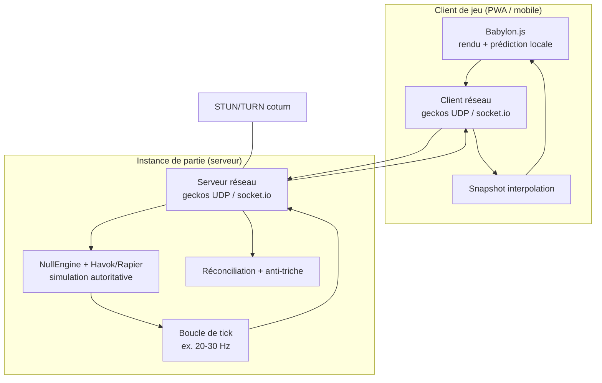
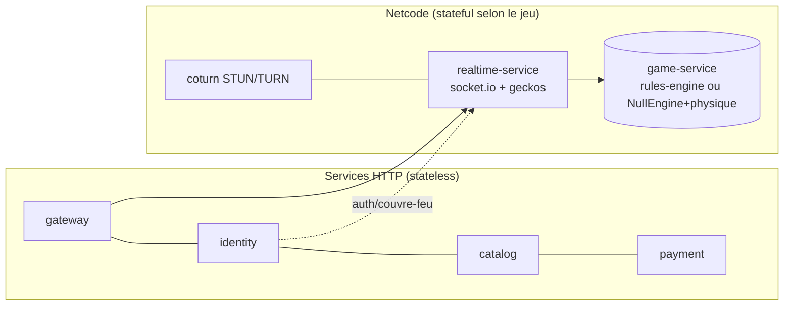

# AFG-DT-005 : Pile Technique du Moteur & du Runtime Temps Réel

**African Games Framework : Plateforme Bilibilia**
**Version :** b2 · 14.07.2026 · **Statut :** Décision technique (moteur/runtime jeux d'action)

Ce document fixe la pile du **moteur de jeu** et du **runtime temps réel** pour les jeux du catalogue qui l'exigent (action/3D), en complément du moteur de règles au tour par tour déjà défini pour `game-service`. Il précise le rendu, la physique, le réseau, la boucle serveur-autoritative et l'infrastructure associée.

---

## 1. Décisions

| Domaine | Choix | Rôle |
| --- | --- | --- |
| **Rendu 3D (client)** | **Babylon.js** (WebGL2/WebGPU) | Rendu des jeux 3D dans le player PWA/mobile. |
| **Simulation (serveur)** | **Babylon.js `NullEngine`** (headless, Node) | Exécuter la scène/physique côté serveur sans pipeline graphique, pour l'autorité serveur. |
| **Physique (défaut)** | **Havok** (`@babylonjs/havok`, WASM, MIT) | Intégration native Babylon, gratuit, le moins de code ; tourne aussi headless via NullEngine. |
| **Physique (option déterministe)** | **Rapier** (`rapier3d-simd`, Rust→WASM) | Quand un jeu compétitif exige du déterministe cross-plateforme ; renderer-agnostic. |
| **Réseau temps réel (action)** | **geckos.io** (UDP via WebRTC/libdatachannel) | Messages rapides non ordonnés/non fiables pour les jeux d'action (sport, 3D nerveuse). |
| **Réseau tour-par-tour / social** | **Socket.io** (WebSocket/TCP) | Quiz, cartes, awalé, plateau, lobby, présence, chat : pas besoin d'UDP. |
| **Sync d'état** | **@geckos.io/snapshot-interpolation** | Interpolation de snapshots pour lisser le mouvement des entités distantes. |
| **Encodage réseau** | **schema typed-array → buffer** (binaire) | Paquets compacts (bande passante faible = contrainte africaine). |

> **Principe directeur : le bon transport pour le bon jeu.** La majorité des jeux du CDCF (calcul mental, quiz, Awalé, cartes, stratégie au tour) sont **tour-par-tour** : ils passent par **Socket.io** et le `rules-engine` de `game-service`. Seuls les jeux **temps réel/action** (football, boxe, 3D nerveuse) justifient **geckos.io (UDP)** et un moteur physique. On n'impose pas Babylon+Havok+geckos à un quiz : voir la matrice §5.

---

## 2. Correction de terminologie (important)

**geckos.io n'est pas du WebSocket.** C'est de l'**UDP via les data channels WebRTC** (basé sur `libdatachannel`, avec ICE/STUN/TURN/SCTP). C'est précisément son intérêt : latence plus faible et messages **non ordonnés / non fiables** possibles, adaptés à l'action temps réel. Le WebSocket (TCP, ordonné/fiable) reste géré par **Socket.io** pour tout ce qui est tour-par-tour, lobby, présence et chat. Les deux coexistent dans le runtime, activés selon le jeu.

---

## 3. Architecture serveur-autoritative (jeux d'action)

**Boucle type (jeu d'action) :** le client envoie ses **entrées** (inputs), le serveur simule (NullEngine + physique) à un tick fixe, diffuse des **snapshots** d'état ; le client applique **prédiction locale + réconciliation** et **interpole** les entités distantes. L'autorité (score, collisions, victoire) est **serveur** → anti-triche par construction.

**Boucle type (tour-par-tour) :** pas de physique ni de tick continu ; le serveur applique le **moteur de règles** (`game-service/rules-engine`) sur chaque action et diffuse l'état via Socket.io. Simple, robuste, léger : c'est le cas de la majorité des jeux de la plateforme.

---

## 4. Physique : Havok vs Rapier (recommandation)

- **Havok = défaut.** Backend physique par défaut de Babylon depuis la v6, gratuit (MIT), WASM ; bodies attachés aux meshes, transforms synchronisés automatiquement, step dans la boucle de scène. Fonctionne **headless** côté serveur via NullEngine. Contrepartie : **couplé à Babylon** (pas d'API standalone documentée) : ce qui nous convient puisqu'on utilise Babylon des deux côtés.
- **Rapier = option déterministe.** Le plus rapide du web en 2026 (Rust→WASM SIMD), renderer-agnostic, réputé pour son **déterminisme cross-plateforme** : utile pour du lockstep compétitif. Contrepartie : perte de l'intégration automatique Babylon (binding à écrire).
- **Nuance honnête sur le déterminisme.** Havok n'est **pas garanti bit-déterministe** entre plateformes. Deux stratégies :
  1. **Serveur-autoritatif à état** (recommandé par défaut) : le serveur fait foi, les clients prédisent/réconcilient → le déterminisme strict n'est pas requis. Compatible **Havok**.
  2. **Lockstep déterministe** (si un mode compétitif l'exige) : privilégier **Rapier** en mode déterministe.
- **Caveat mobile :** Havok requiert **WASM SIMD** (indisponible iOS < 16.4) : à gérer par détection de capacité / fallback.

---

## 5. Matrice de choix par type de jeu

| Type de jeu (exemples CDCF) | Rendu | Physique | Réseau | Autorité |
| --- | --- | --- | --- | --- |
| Quiz, calcul mental, culture (Égaliseur) | DOM/Canvas léger (ou Babylon GUI) | : | **Socket.io** | Serveur (règles) |
| Cartes, Awalé, plateau, stratégie au tour | 2D léger / Babylon | : | **Socket.io** | Serveur (règles) |
| Jeux familiaux temps réel léger | Babylon | optionnelle | Socket.io ou geckos | Serveur |
| Sport (football), action, 3D nerveuse | **Babylon 3D** | **Havok** (ou Rapier) | **geckos.io (UDP)** + snapshot interp. | Serveur-autoritatif (tick) |
| Compétitif déterministe (lockstep) | Babylon 3D | **Rapier** déterministe | geckos.io | Lockstep |

Ce tableau évite la sur-ingénierie : on n'active le trio Babylon 3D + physique + UDP que là où l'action le justifie. La très grande majorité du catalogue MVP (jeux éducatifs, culturels, familiaux au tour par tour) reste sur Socket.io + `rules-engine`, sans Babylon ni physique.

---

## 6. Impact sur les services & le SDK

- **`realtime-service` devient bi-transport.** Il expose **Socket.io** (tour-par-tour, présence, chat) **et**, pour les jeux d'action, **geckos.io** (UDP), avec snapshot-interpolation et encodage binaire.
- **`game-service` héberge la simulation pour les jeux d'action.** Boucle de tick + NullEngine + physique quand le jeu l'exige ; sinon, moteur de règles classique (majorité des cas).
- **`bilia-sdk` expose ces briques en option :** API Babylon (rendu), abstraction physique (Havok/Rapier), abstraction réseau (geckos/socket), snapshot interpolation, prédiction/réconciliation, schéma binaire : utilisées seulement par les jeux qui en ont besoin.

---

## 7. Infrastructure spécifique (complément à AFG-DT-001)

Le support des jeux d'action ajoute des exigences d'infra ciblées, seulement là où geckos.io/UDP est utilisé :

- **STUN/TURN** auto-hébergés (**coturn**) pour la traversée NAT de geckos.io (WebRTC). TURN sert de repli quand l'UDP direct échoue.
- **Plage de ports UDP** ouverte (ex. `10000-20000`) + **port de signalisation 9208** ; les instances de `game-service` qui hébergent des parties d'action ont besoin d'IP publiques joignables.
- **Observabilité temps réel** : tickrate, RTT, perte de paquets, drops (geckos expose `onDrop`), CCU par jeu.

---

## 8. Dépendances (packages)

- Client : `@babylonjs/core`, `@babylonjs/havok` (ou `@dimforge/rapier3d-simd`), `@geckos.io/client`, `socket.io-client`, `@geckos.io/snapshot-interpolation`.
- Serveur : `@babylonjs/core` (NullEngine), `@babylonjs/havok` (ou `rapier3d`), `@geckos.io/server`, `socket.io`, `@geckos.io/snapshot-interpolation`, `@geckos.io/typed-array-buffer-schema`.
- Infra : `coturn` (STUN/TURN), uniquement pour les déploiements exposant des jeux d'action en geckos.io.

---

## 9. Décisions actées

1. **Babylon.js** pour le rendu 3D (client) et la **simulation headless serveur** (NullEngine), utilisé par les jeux qui en ont besoin.
2. **Havok par défaut** (intégration Babylon, gratuit MIT, headless serveur) ; **Rapier** en option pour le déterministe.
3. **Réseau bi-transport** : **geckos.io (UDP/WebRTC)** pour les jeux d'action, **Socket.io (WS)** pour le tour-par-tour/social (cas majoritaire) : choisi par type de jeu, pas par défaut plateforme.
4. **Autorité serveur** par défaut pour les jeux d'action (prédiction/réconciliation client) ; lockstep déterministe seulement si un mode compétitif l'exige.
5. **STUN/TURN (coturn)** ajouté à l'infra, activé seulement pour les déploiements avec jeux d'action.
6. **`realtime-service`** devient bi-transport ; **`game-service`** héberge la simulation des jeux d'action en plus du moteur de règles ; **`bilia-sdk`** expose ces briques moteur en option.

*Fiches mises à jour : `realtime-service`, `game-service`, `shared-and-sdk`. Référencé par AFG-DT-000 (pile technologique).*
