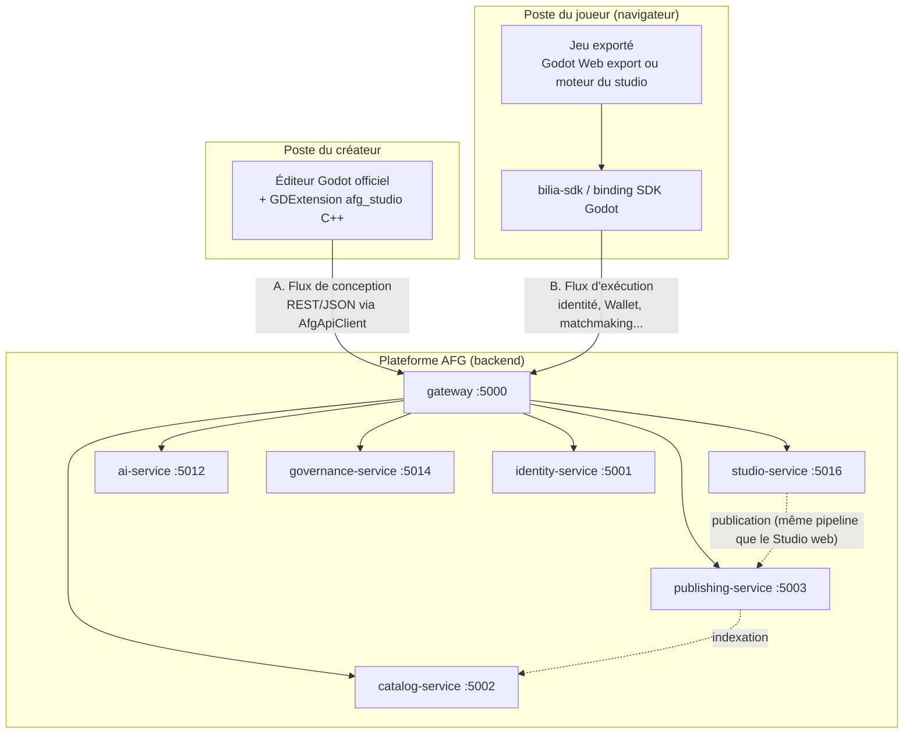
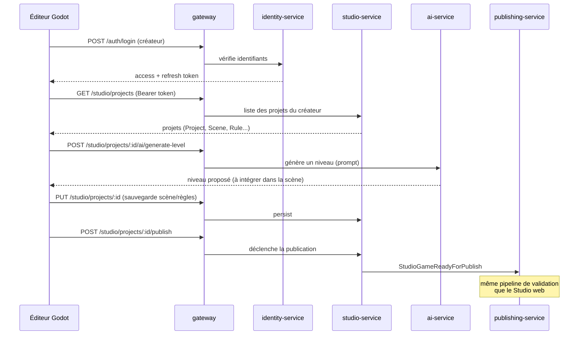
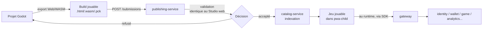

# Guide de prise en main : Godot dans l'écosystème AFG

**Statut :** guide pratique (pas un document de décision : la décision et sa justification sont dans `docs/AFG-DT-001_architecture-globale.md` ADR-11 et `docs/AFG-DT-004_decisions-ouvertes.md` §7).
**Public :** toi, en tant que lead dev/archi, avant de toucher à `apps/studio-editor-native/`.

## 1. En une phrase

Godot n'est **pas** le moteur de jeu de la plateforme (ça reste Babylon.js + NullEngine côté serveur, cf. AFG-DT-005). Godot est l'**éditeur** utilisé par `apps/studio-editor-native` : un outil desktop en C++ (GDExtension) pour les créateurs avancés (Niveau 3-4), qui vient **en plus** du Studio web no-code. Les deux parlent à la même API `studio-service`.

Deux flux à bien distinguer, traités séparément ci-dessous :

- **Flux A : temps de conception** : l'éditeur Godot (sur ta machine, ou celle d'un créateur) parle aux services backend AFG pour créer/éditer/publier un projet.
- **Flux B : temps d'exécution** : le jeu une fois exporté et publié parle à la plateforme comme n'importe quel autre jeu AFG, pour l'identité, le Wallet, le matchmaking, etc.

---

## 2. Schéma d'ensemble



Le point important : **il n'y a qu'une porte d'entrée réseau, le `gateway`**. Godot ne parle jamais directement à MongoDB ni à un service en interne : comme le Studio web, comme la PWA joueur.

---

## 3. Mise en place (installation)

### Prérequis

- **Godot Editor officiel** (4.3+, actuellement 4.7.x) : téléchargé depuis godotengine.org, **pas vendored** dans le repo. C'est un binaire tiers que tu installes toi-même, comme VS Code.
- Compilateur C++20 (MSVC / clang / gcc selon ton OS), CMake ≥ 3.22.
- `vcpkg` (ou installation manuelle de `cpp-httplib`, `nlohmann-json`, `Catch2`).
- `git` (pour le submodule `godot-cpp`).

### Étapes

```bash
cd apps/studio-editor-native

# 1. Récupérer les bindings C++ officiels de Godot (MIT, submodule git)
git submodule update --init --recursive third_party/godot-cpp

# 2. Installer les dépendances C++ (héader-only, légères)
vcpkg install   # ou: installer cpp-httplib / nlohmann-json / catch2 manuellement

# 3. Compiler le GDExtension AFG
cmake -B build -S .
cmake --build build --config Release
# → génère project/addon/afg_studio/bin/afg_studio.<ext>

# 4. Ouvrir l'éditeur
# Lancer Godot, "Importer", pointer sur apps/studio-editor-native/project/
# Le plugin AFG Studio se charge automatiquement (project.godot → [editor_plugins])
```

À ce stade tu as un éditeur Godot qui démarre avec des panneaux AFG vides (stubs `TODO`, cf. `ROADMAP.md`) : le câblage réel vers les services vient ensuite, lot par lot.

**Aucun fork de Godot.** Tu ne recompiles jamais le moteur : tu compiles seulement la bibliothèque `afg_studio` que l'éditeur stock charge au démarrage. Une mise à jour de version Godot = changer le binaire téléchargé, pas re-porter du code.

---

## 4. Flux A : communication Godot ↔ services (temps de conception)

Toute la communication passe par une seule classe : `AfgApiClient` (`src/api/afg_api_client.*`), un client HTTP/JSON qui appelle le `gateway` exactement comme le ferait un `fetch()` du Studio web. Même contrat d'API des deux côtés (`contracts/openapi`) : aucune API dupliquée ou divergente à maintenir.



Qui appelle quoi, concrètement (services déjà scaffoldés, endpoints déjà stubés) :

| Service | Ce que Godot lui demande |
| --- | --- |
| `identity-service` | Connexion créateur, rafraîchissement de token |
| `studio-service` | CRUD projets/scènes/règles/variables, sandbox, tests, publication |
| `catalog-service` | Parcourir/importer templates, assets, composants marketplace |
| `ai-service` | Les 6 générateurs IA + copilote (AFG-005 ch.20-25/45) |
| `governance-service` | Évaluer l'éligibilité aux 7 badges de certification AFG |
| `publishing-service` | Jamais appelé directement : `studio-service` s'en charge après validation |

Le pont important côté règles : `AfgRuleResource::to_rules_engine_json()` (`src/resources/afg_rule_resource.*`) doit produire **exactement** le format que consomme `game-service/rules-engine` côté serveur (cf. `contracts/`). C'est le seul point où une divergence casserait un jeu au runtime : à verrouiller au **Lot Studio natif #2** (cf. `apps/studio-editor-native/ROADMAP.md`).

---

## 5. Deux façons de créer un jeu avec Godot

AFG-005 distingue les créateurs Niveau 3 (développeur, utilise le SDK/API) et Niveau 4 (studio pro, garde son propre moteur). Ça donne deux chemins d'intégration différents pour un jeu construit dans l'éditeur Godot :

| | **Mode assisté** (Niveau 3) | **Mode pro** (Niveau 4) |
| --- | --- | --- |
| Scènes/règles | Construites avec les ressources AFG (`AfgSceneResource`, `AfgRuleResource`) | Godot natif complet (GDScript/C++, scripts custom) |
| Moteur de règles | Le même que `game-service` (JSON partagé, prévisualisable) | Logique propre au studio, hors rules-engine AFG |
| Ce que le jeu utilise de la plateforme | Rendu + logique + SDK AFG | Uniquement le SDK AFG (Wallet, Matchmaking, Tournois, IDC : cf. AFG-004 ch.33) |
| Analogie | Un jeu "template + règles visuelles" | "J'apporte mon moteur, je branche juste les services communs" |

Les deux passent par le même export et la même publication (§6) : la différence est **combien** du jeu vient d'AFG vs du studio lui-même.

---

## 6. Flux B : comment le jeu exporté s'intègre à l'écosystème (temps d'exécution)

Un jeu conçu dans Godot ne reste pas dans Godot : il est **exporté** (Godot → export Web/HTML5/WASM, cohérent avec la stratégie PWA-first bas-débit d'AFG-DT-000 §3 : les exports natifs desktop/mobile restent une option P3+, pas une priorité MVP) puis publié comme n'importe quel autre jeu.



**Le point le plus important : au runtime, le jeu exporté ne parle plus à Godot.** Il parle à la plateforme exactement comme un jeu construit dans le Studio web : via le **SDK** (`bilia-sdk` ou son équivalent binding Godot), pas via l'éditeur.

Deux options pour ce pont SDK côté jeu exporté, à trancher au **Lot Studio natif #3+** :

1. **Court terme (recommandé pour démarrer)** : export Web Godot + `JavaScriptBridge` (singleton Godot officiel) pour appeler directement le `bilia-sdk` JS déjà chargé sur la page : zéro réimplémentation du SDK, on réutilise ce qui existe déjà côté web.
2. **Long terme** : binding SDK natif en GDExtension (miroir C++ du `bilia-sdk`), pour les exports non-Web (desktop/mobile, si un jour nécessaire) : plus de travail, mais indépendant du navigateur.

Rien de tout ça n'est câblé aujourd'hui (scaffold uniquement) : c'est le sujet du **Lot Studio natif #3** de `apps/studio-editor-native/ROADMAP.md`.

---

## 7. Ce qui existe déjà vs ce qui reste à faire

| | Statut |
| --- | --- |
| Structure GDExtension (CMake, submodule, `.gdextension`) | ✅ scaffoldé |
| Ressources AFG (`Project`/`Scene`/`Rule`/`Variable`) | ✅ scaffoldées (mapping de données uniquement) |
| Panneaux d'éditeur (dock, IA, marketplace, certification, collab) | ✅ scaffoldés (classes vides, `TODO`) |
| `AfgApiClient` réellement câblé (HTTP + auth) | ❌ Lot Studio natif #1 |
| Édition de règles + prévisualisation locale fidèle à `game-service` | ❌ Lot Studio natif #2 |
| Générateurs IA branchés | ❌ Lot Studio natif #3 |
| Marketplace + certification branchées | ❌ Lot Studio natif #4 |
| Collaboration/versioning + publication réelle | ❌ Lot Studio natif #5 |
| Pont SDK runtime (jeu exporté ↔ plateforme) | ❌ à trancher (§6), non planifié dans un lot précis encore |

## 8. Références

- Décision & alternatives évaluées : `docs/AFG-DT-001_architecture-globale.md` ADR-11, `docs/AFG-DT-004_decisions-ouvertes.md` §7.
- Détail du backend consommé : `docs/modules/studio-service.md`.
- Architecture technique du GDExtension : `apps/studio-editor-native/README.md`.
- Roadmap de construction : `apps/studio-editor-native/ROADMAP.md`.
- Moteur/runtime des jeux (rappel : reste Babylon.js, pas Godot) : `docs/AFG-DT-005_moteur-runtime-temps-reel.md`.
